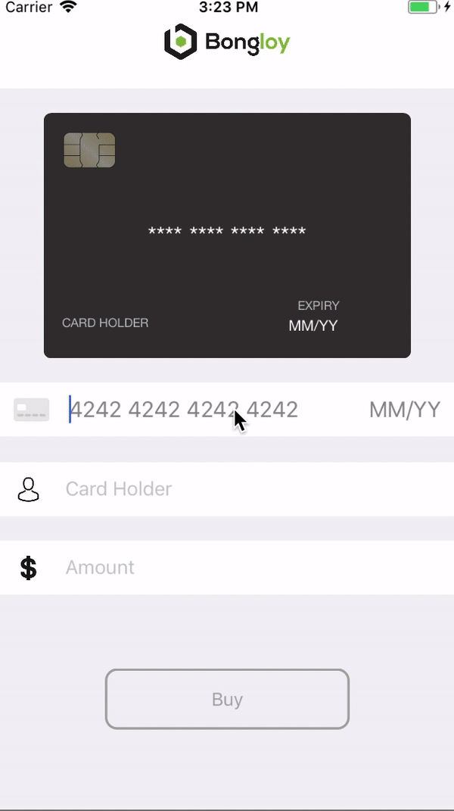

<p align="center"></p>

Bongloy-demo-ios is a iOS app which demonstrates how to use Bongloy.
### Screenshots


## Installation

    $ git clone https://github.com/khomsovon/bongloy-demo-ios.git
  ```sh
  cd bongloy-demo-ios
  ```
  ```sh
  pod install
  ```
  ```sh
  open bongloy-demo-ios.xcworkspace
  ```
  Fill in the `BONGLOY_PUBLISHABLE_KEY` and `BACKEND_BASE_URL` constant in ./bongloy-demo-ios/Utilities/Constants.swift
```swift
let BACKEND_BASE_URL = "Your backend base url"
let BONGLOY_PUBLISHABLE_KEY = "sk_test_****************************************************************"
```
`BONGLOY_PUBLISHABLE_KEY` Find it [here](https://sandbox.bongloy.com/dashboard/account_details)
and Bongloy demo backend [here](https://github.com/bongloy/bongloy-demo-laravel)
## Integration
#### Install and configure the SDK
   - If you haven't already, install the latest version of [CocoaPods](https://guides.cocoapods.org/using/getting-started.html)
   - Add this line to your Podfile
      ```ssh
      pod 'Stripe'
      ```
   - Run the following command
      ```ssh
      pod install
      ```
   - Don't forget to use the .xcworkspace file to open your project in Xcode, instead of the .xcodeproj file, from here on out.
   - In the future, to update to the latest version of the SDK, just run:
      ```ssh
      pod update Stripe
      ```

#### Configure your Bongloy integration in your App Delegate

After you're done installing the SDK, configure it with your Bongloy API keys in `AppDelegate.swift`.

``` swift
import UIKit
import Stripe

@UIApplicationMain
class AppDelegate: UIResponder, UIApplicationDelegate {

  func application(_ application: UIApplication, didFinishLaunchingWithOptions launchOptions: [UIApplicationLaunchOptionsKey: Any]?) -> Bool {
      STPPaymentConfiguration.shared().publishableKey = BONGLOY_PUBLISHABLE_KEY
      // do any other necessary launch configuration
      return true
  }
}
```
#### Create `BongloyAPIClient` class
  

  Make sure `Subclass of` selected STPAPIClient and Language Objective-C click Next -> Create -> Create Bridging Header

  `projectName-Bridging-Header.h`
  ``` objc
  #import "BongloyAPIClient.h"
  ```
  `BongloyAPIClient.h`
  ``` objc
  #import <Stripe/Stripe.h>

  @interface BongloyAPIClient : STPAPIClient

  @property (nonatomic, strong, readwrite) NSURL *apiURL;
  @property (nonatomic, strong, readonly) NSURLSession *urlSession;
  @property (nonatomic, strong, readwrite) NSString *apiKey;

  - (instancetype)initWithConfiguration:(STPPaymentConfiguration *)configuration NS_DESIGNATED_INITIALIZER;

  @end
  ```
  `BongloyAPIClient.m`
  ``` objc
#import "BongloyAPIClient.h"

static NSString * const APIBaseURL = @"https://api.bongloy.com/v1";

@implementation BongloyAPIClient

- (instancetype)initWithConfiguration:(STPPaymentConfiguration *)configuration {
    NSString *publishableKey = [configuration.publishableKey copy];
    self = [super initWithConfiguration:configuration];
    if (self) {
        _apiKey = publishableKey;
        _apiURL = [NSURL URLWithString:APIBaseURL];
        _urlSession = [NSURLSession sessionWithConfiguration:[NSURLSessionConfiguration defaultSessionConfiguration]];
    }
    return self;
}
@end
  ```
#### Create Token
  ``` swift
    let cardParams = STPCardParams()
    cardParams.number = "4242424242424242"
    cardParams.expMonth = 10
    cardParams.expYear = 2018
    cardParams.cvc = "123"

    BongloyAPIClient.shared().createToken(withCard: cardParam) { (token: STPToken?, error: Error?) in
      guard let token = token, error == nil else {
          // Present error to user...
          return
      }

      // do anything
    }
  ```
## Official Documentation

Documentation for Bongloy can be found on the [Bongloy website](https://www.bongloy.com/documentation).
